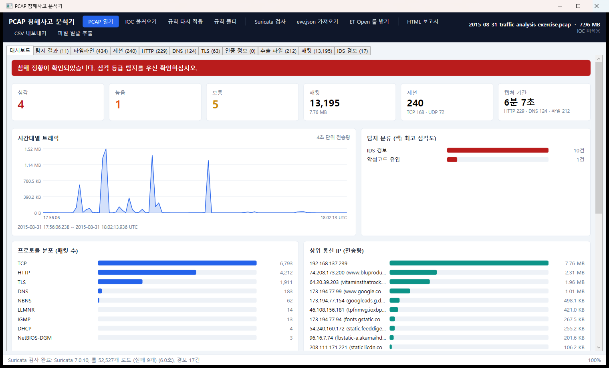
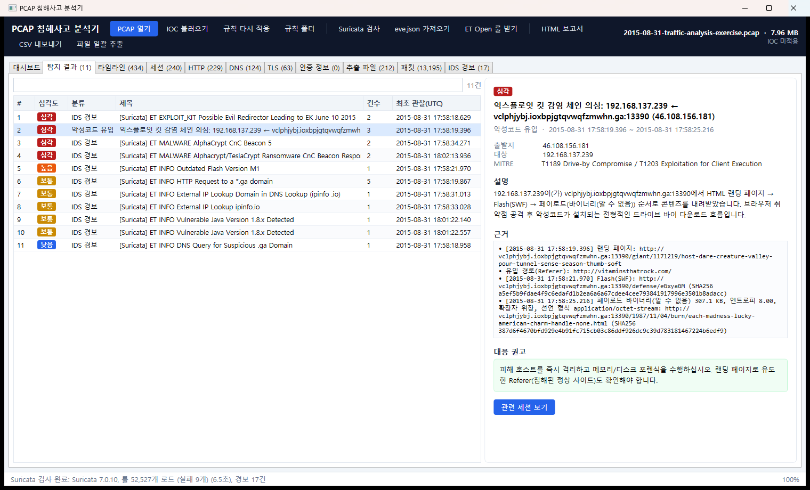
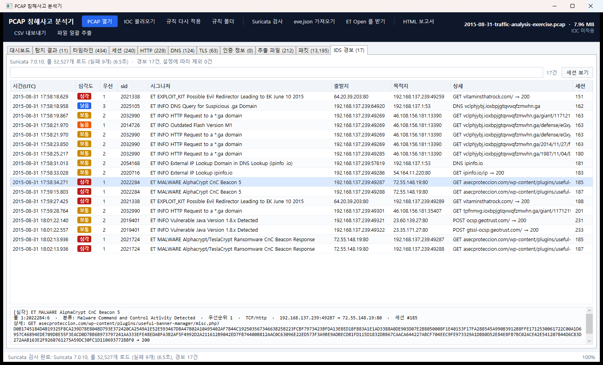
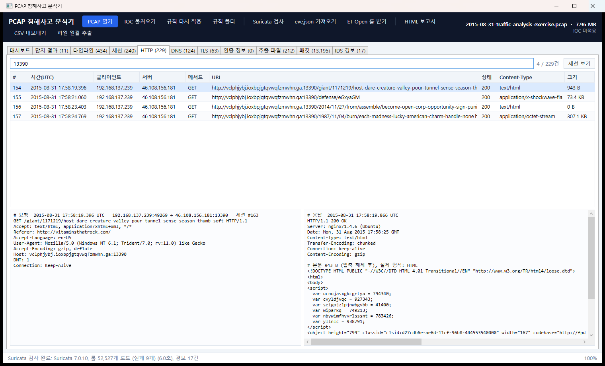
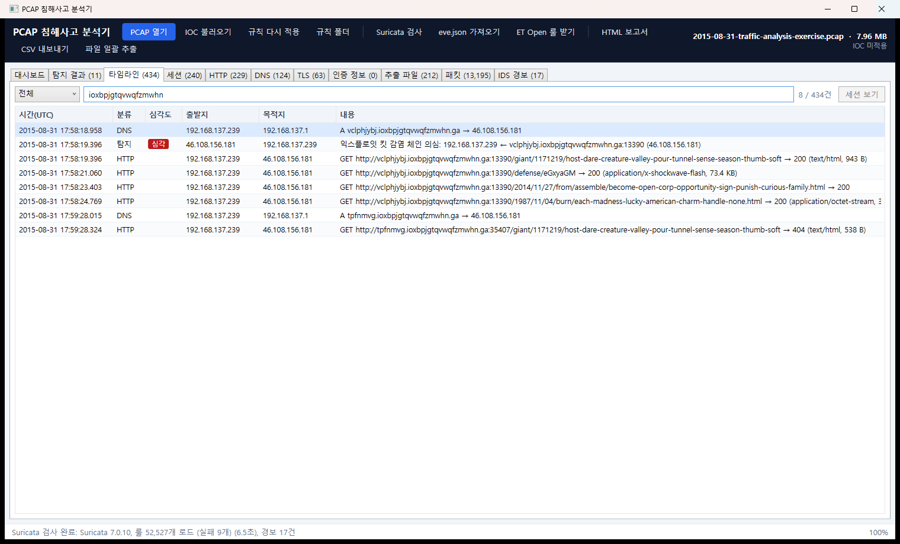
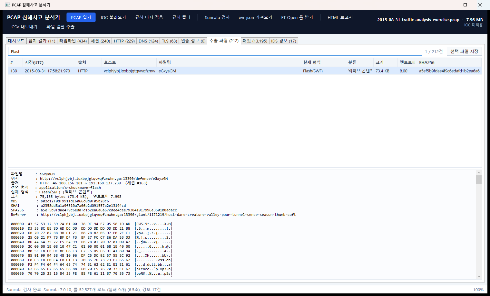

# PCAP 침해사고 분석기 (PCAP Forensics Analyzer)

캡처 파일(pcap / pcapng)을 불러와 **침해 흔적을 자동으로 찾아 주는** C# (.NET 8) 도구입니다.
WPF GUI와 명령줄(CLI)을 제공하며, 자체 탐지 엔진에 **Suricata(ET Open 룰)** 경보를 결합해 한 화면에서 분석합니다.

- 외부 NuGet 패키지 없이 pcap/pcapng 파싱, TCP 재조립, HTTP/DNS/TLS/평문 인증 해석을 직접 구현
- 탐지 결과마다 근거, MITRE ATT&CK, 대응 권고, 관련 세션 연결
- HTML 보고서, CSV, 전송 파일 추출(해시 포함) 지원



## 다운로드

[**Releases**](https://github.com/ngnicky-ai/pcap-forensics-analyzer/releases/latest)에서 `PcapForensics-v1.1.0-win-x64.zip`을 받아 압축을 풀고 `PcapForensics.exe`를 실행합니다.
.NET 런타임을 따로 설치할 필요가 없습니다(Windows x64, self-contained).

| 파일 | 설명 |
|---|---|
| `PcapForensics.exe` | GUI. 파일을 열거나 창에 끌어다 놓으면 분석 |
| `pcapir.exe` | CLI. 일괄 분석·자동화용 |
| (선택) [Npcap](https://npcap.com) | 실시간 모니터링에 필요. 파일 분석만 할 때는 없어도 됩니다 |
| `rules\` | 탐지 임계값(`settings.json`), 웹 공격 시그니처(`web_attack_rules.json`) |

## 실습: 익스플로잇 킷 → 랜섬웨어 감염 분석

저장소의 [`samples/2015-08-31-traffic-analysis-exercise.pcap`](samples/)으로 분석 과정을 따라 할 수 있습니다.
(출처: [malware-traffic-analysis.net](https://www.malware-traffic-analysis.net/) 2015-08-31 트래픽 분석 연습 문제. **실제 악성 트래픽이 포함되어 있으니 격리된 환경에서 다루십시오.**)

### 1. 파일 열기 → 대시보드

`PcapForensics.exe`를 실행하고 pcap 파일을 창에 끌어다 놓습니다. 13,195개 패킷, 240개 세션을 1초 안에 분석하고
상단에 판정(침해 정황 확인)과 심각도별 건수, 시간대별 트래픽, 상위 통신 IP를 보여 줍니다(위 화면).
**Suricata 검사**를 누르면 ET Open 룰 약 52,000개로 같은 파일을 검사해 결과를 합칩니다.

### 2. 탐지 결과 — 무엇이 일어났나



자체 엔진이 **익스플로잇 킷 감염 체인**을 하나의 '심각' 탐지로 묶습니다.

1. 침해된 정상 사이트 `vitaminsthatrock.com`(Referer)에서
2. `vclphjybj.ioxbpjgtqvwqfzmwhn.ga:13390` 랜딩 페이지로 유도되고
3. Flash(SWF) 익스플로잇 → 4. 암호화된 페이로드(엔트로피 8.0, `.html`로 위장)를 내려받음

오른쪽 패널에 근거(URL, SHA256), MITRE ATT&CK(T1189, T1203), 대응 권고가 표시되고, **관련 세션 보기**로 해당 트래픽으로 바로 이동합니다.

### 3. IDS 경보 — Suricata가 이름을 붙인 위협



Suricata는 자체 엔진이 찾지 못한 **감염 이후** 단계를 식별합니다.
`ET MALWARE AlphaCrypt CnC Beacon`, `Alphacrypt/TeslaCrypt Ransomware CnC Beacon Response`(72.55.148.19) — 페이로드가 **랜섬웨어**였고 C2 서버와 통신했다는 뜻입니다.
모든 경보는 5-tuple과 시각으로 분석기 세션에 연결됩니다(세션 열).

### 4. HTTP — 랜딩 페이지 내용 확인



chunked + gzip 응답을 자동으로 풀어 보여 줍니다. 랜딩 페이지의 난독화된 변수와 Flash `<object>` 태그를 확인할 수 있습니다.

### 5. 타임라인 — 사건 순서 재구성



DNS 질의 → 탐지 → HTTP 요청 순서로 공격 흐름이 시간순으로 정리됩니다. 검색어(`ioxbpjgtqvwqfzmwhn`)로 관련 이벤트만 거를 수 있습니다.

### 6. 추출 파일 — 증거 확보



HTTP/FTP로 전송된 파일 212개를 추출해 실제 형식(매직 바이트), MD5/SHA1/SHA256, 엔트로피를 계산합니다.
위협 정보 조회에 해시를 그대로 사용할 수 있고, **파일 일괄 추출** 시 실행 가능한 형식에는 `.infected` 확장자를 붙여 저장합니다.

### 결론

| 단계 | 근거 | 탐지 주체 |
|---|---|---|
| 유입 | 침해 사이트 vitaminsthatrock.com → EK 리다이렉터 | Suricata (`ET EXPLOIT_KIT`) |
| 공격 | 랜딩 페이지 → Flash 익스플로잇 → 암호화 페이로드 | 자체 엔진 (감염 체인) |
| 감염 후 | AlphaCrypt/TeslaCrypt 랜섬웨어 C2 통신 | Suricata (`ET MALWARE`) |

피해 호스트 `192.168.137.239`는 격리 및 포렌식 대상이며, 46.108.156.181(EK)과 72.55.148.19(C2)를 차단해야 합니다.
**HTML 보고서** 버튼으로 이 내용을 보고서 한 장으로 저장할 수 있습니다.

## 실시간 모니터링

**● 실시간 모니터링** 버튼으로 이 PC의 네트워크를 직접 캡처해 분석합니다. [Npcap](https://npcap.com)이 필요합니다(Wireshark를 설치했다면 이미 있습니다).

1. 캡처할 인터페이스를 고릅니다. 실제 어댑터(유선·무선), 가상 어댑터(VMware·Hyper-V·WSL 등), 루프백(이 PC 내부 통신)이 모두 표시되며 기본으로 전부 선택됩니다.
2. **최대 용량(MB)**과 **최대 시간(분)**을 정합니다. 이 PC의 가용 메모리로 분석 가능한 권장 최대 용량을 계산해 보여 주고, 넘으면 경고합니다(분석 메모리 ≈ 80MB + 캡처 크기 × 3, 실측).
3. **모니터링 시작** → 인터페이스별 수신량, 초당 전송량, 최근 패킷이 실시간으로 갱신됩니다.
4. 제한의 80%에 도달하면 남은 시간과 함께 경고하고, 100%에 도달하면 자동으로 멈춥니다. **중지하고 분석**을 누르거나 제한에 도달하면 저장된 파일을 바로 분석합니다.

- 모든 인터페이스를 하나의 **pcapng** 파일(인터페이스별 링크 타입 보존)로 `%LocalAppData%\PcapForensics\captures`에 저장하므로, 원본 증거로 보관하거나 Wireshark에서 열 수 있습니다.
- 무차별(promiscuous) 모드를 기본으로 사용하며, 지원하지 않는 어댑터는 일반 모드로 자동 전환합니다.
- 가상 스위치·브리지 때문에 같은 패킷이 두 인터페이스에서 잡히면 분석 시 중복으로 제외하고 경고합니다.
- CLI: `pcapir --list-interfaces`, `pcapir --capture --duration 60 --max-mb 200 [--iface 1,3] [--out 파일]` (Ctrl+C로 중지 후 자동 분석)

## 탐지 항목

| 분류 | 내용 | MITRE ATT&CK |
|---|---|---|
| 정찰 | 수직 포트 스캔, 수평 호스트 스윕, 웹 취약점 스캐너 User-Agent | T1046, T1595.002 |
| 계정 공격 | 평문 프로토콜 무차별 대입(성공 시 심각), 인증 포트 반복 접속, 웹 로그인 반복, 기본/취약 비밀번호 로그인 | T1110, T1078.001 |
| 웹 공격 | SQLi, XSS, 경로 탐색/LFI, 명령어 삽입, Log4Shell, Shellshock + 응답의 공격 성공 징후 | T1190, T1059 |
| 웹셸 | PUT·multipart·Tomcat Manager 업로드 → 업로드 경로 사용까지 연결 | T1505.003 |
| 악성코드 유입 | 실행 파일/확장자 위장, Flash·Java, 고엔트로피 암호화 페이로드, 익스플로잇 킷 감염 체인 | T1105, T1189, T1036 |
| C2 / 유출 | DNS 터널링, NXDOMAIN 다발(DGA), 주기적 비컨, IP 직접 HTTP 접속 | T1071, T1568.002 |
| 중간자 공격 | ARP 스푸핑(한 IP에 여러 MAC) | T1557.002 |
| 정보 노출 | FTP/POP3/IMAP/SMTP/HTTP Basic·Form 평문 인증 정보 | T1040, T1552 |
| IOC 일치 | IP·CIDR·도메인(하위 포함)·파일 해시(MD5/SHA1/SHA256) | — |
| IDS 경보 | Suricata eve.json 경보(직접 실행 또는 가져오기) | 룰 메타데이터 |

임계값은 `rules\settings.json`, 웹 공격 시그니처는 `rules\web_attack_rules.json`에서 수정합니다.
수정 후 **규칙 다시 적용**을 누르면 다시 분석하지 않고 탐지만 재실행합니다. 새 탐지 로직은 `IDetector`를 구현해 `PcapAnalyzer.Detectors`에 추가합니다.

## Suricata 연동

자체 탐지는 공격 *유형*(무차별 대입, 웹셸, 비컨 등)을, Suricata 룰은 특정 악성코드·CVE·익스플로잇 킷을 *이름*으로 식별합니다.

**설치 (Windows)**
1. `winget install OISF.Suricata` (Npcap 필요. WinPcap 호환 모드가 아니어도 분석기가 `System32\Npcap`을 PATH에 넣어 실행합니다.)
2. GUI **ET Open 룰 받기** 또는 `pcapir --update-rules` → `%LocalAppData%\PcapForensics\et-open\rules`에 설치
3. GUI **Suricata 검사** 또는 `pcapir <pcap> --suricata`

- **eve.json 가져오기**: Suricata가 없는 PC에서도, 다른 장비에서 **같은 pcap**을 검사한 `eve.json`을 불러올 수 있습니다. 세션과 하나도 맞지 않으면 경고합니다.
- **심각도**: Suricata 우선순위(1~4)를 `SeverityMap`으로 변환하고, 시그니처에 `EscalateKeywords`(EXPLOIT_KIT, MALWARE, CnC 등)가 있으면 한 단계 올립니다.
- **오탐 관리**: `IgnoreSids`, `IgnoreSignaturePrefixes`(기본값: `SURICATA STREAM` 등). 제외된 경보는 IDS 경보 탭에 '제외'로 남습니다.
- **라이선스**: ET Open은 자유롭게 사용할 수 있지만 Snort Talos 룰셋은 재배포 제한이 있으니 동봉하지 마십시오.

## CLI

```powershell
pcapir samples\2015-08-31-traffic-analysis-exercise.pcap --suricata --html report.html --csv out --extract files
```

| 옵션 | 설명 |
|---|---|
| `--ioc <파일>` | IOC 목록(IP/CIDR/도메인/URL/해시, 무력화 표기 지원)과 대조. 형식: [`iocs/example_iocs.txt`](iocs/example_iocs.txt) |
| `--html <파일>` / `--csv <폴더>` / `--extract <폴더>` | 보고서, CSV, 전송 파일 저장 |
| `--suricata` / `--eve <파일>` / `--update-rules` | Suricata 검사, eve.json 가져오기, ET Open 룰 받기 |
| `-v`, `--session <번호>` | 상세 출력, 세션 스트림 출력 |

종료 코드: 심각/높음 탐지가 있으면 `2`, 없으면 `0`, 오류면 `1` (배치 자동화용).

## 빌드와 테스트

```powershell
dotnet build PcapForensics.sln -c Release
dotnet run --project src/PcapForensics.App -- samples/2015-08-31-traffic-analysis-exercise.pcap
dotnet test
```

```
src/
  PcapForensics.Core/   분석 엔진: Pcap · Capture · Decoding · Sessions · Protocols · Detection · Ids · Analysis · Reporting · Rules
  PcapForensics.App/    WPF GUI
  PcapForensics.Cli/    명령줄 도구 (pcapir)
tests/
  PcapForensics.Tests/  xUnit 47개
```

- **단위 테스트**: pcap/pcapng 리더(엔디언·나노초·잘린 파일), 디코더(VLAN·IPv6·ARP·패딩), TCP 재조립(순서 뒤바뀜·재전송·겹침), DNS(압축 포인터·루프), HTTP(chunked+gzip·HEAD·100 Continue), FTP/SMTP 인증, IOC, 파일 형식, eve.json, Suricata 인수, pcapng 작성·인터페이스 간 중복 제거
- **회귀 테스트**: 샘플 캡처별 탐지 결과 고정(과거 오탐 재발 방지 포함). 저장소에 없는 샘플(FTP 무차별 대입, Tomcat 웹셸)과 Suricata 미설치 환경의 테스트는 자동으로 건너뜁니다.

## 참고

- 확대/축소: **Ctrl + 마우스 휠**, **Ctrl + `+` / `-`**, 원래 크기 **Ctrl + 0** (배율은 다음 실행 때도 유지)
- 모든 시각은 **UTC**입니다. 분석 대상 파일의 SHA-256을 기록해 증거 무결성을 확인할 수 있습니다.
- 시각과 내용이 같은 중복 프레임(캡처 병합 등)은 자동으로 세션 분석에서 제외하고 경고합니다.
- 패킷을 모두 메모리에 올려 분석하므로 수 GB 단위 캡처는 `editcap` 등으로 나눠 분석하십시오.
- 암호화 트래픽(TLS/SSH/RDP)은 내용 대신 SNI와 연결 패턴(비컨, 반복 접속)으로 판단합니다.
